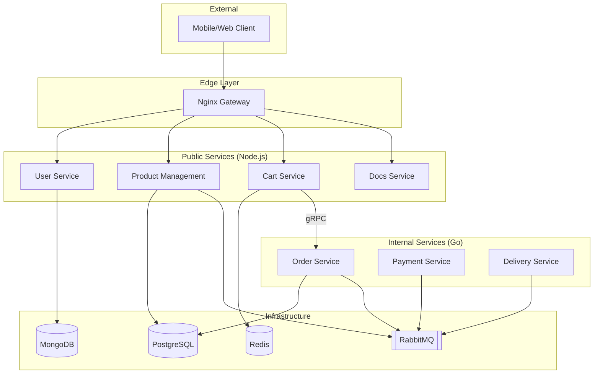

# Distributed Ecommerce Project

A production-ready microservices architecture for an e-commerce platform, built with Go, Node.js, and a suite of modern data stores and messaging systems.

## 🚀 Overview

This project implements a distributed e-commerce system designed for scalability, high availability, and loose coupling. It demonstrates best practices in microservices architecture, including DDD (Domain-Driven Design), event-driven communication, and containerized deployment.

### ⚠️ Problem Statement

Building a monolithic e-commerce platform often leads to "Big Ball of Mud" architectures where scaling specific components (like search or payments) is difficult, and a failure in one module can bring down the entire system. 

This project solves these issues by:
- **Service Isolation**: Each domain (Users, Products, Orders, etc.) is a separate service.
- **Polyglot Persistence**: Using the best database for the job (Redis for speed, PostgreSQL for relational data, MongoDB for flexible user profiles).
- **Event-Driven Workflows**: Long-running processes like payment and delivery are handled asynchronously via RabbitMQ.
- **API Orchestration**: An Nginx gateway provides a single entry point, while internal services communicate via gRPC or message queues.

## 🛠️ Tech Stack

- **Backend**: [Go](https://golang.org/) (High-performance internal services), [Node.js](https://nodejs.org/) (IO-intensive public services).
- **Communication**: 
  - **REST**: External client communication via Nginx.
  - **gRPC**: High-performance, low-latency internal service-to-service communication.
  - **RabbitMQ**: Asynchronous event-driven messaging for decoupled workflows.
- **Databases**: 
  - **PostgreSQL**: Relational data for Products and Orders.
  - **MongoDB**: Flexible document storage for User profiles.
  - **Redis**: Low-latency cache and session storage for Carts.
- **Infrastructure**: Docker & Docker Compose for orchestration.

## 🏗️ System Architecture



## 📦 Services Breakdown

| Service | Responsibility | Stack |
| :--- | :--- | :--- |
| **User Service** | Auth, Profiles, JWT management. | Node.js, MongoDB |
| **Product Management** | Catalog, Search, Inventory updates. | Node.js, PostgreSQL, RabbitMQ |
| **Cart Service** | Real-time cart management, TTL sessions. | Node.js, Redis, gRPC Client |
| **Order Service** | Order lifecycle, gRPC server. | Go, PostgreSQL, RabbitMQ |
| **Payment Service** | Payment processing (Mock). | Go, RabbitMQ |
| **Delivery Service** | Shipment tracking (Mock). | Go, RabbitMQ |
| **Docs Service** | Unified Swagger UI documentation. | Node.js |

## 📂 Project Structure

```text
.
├── cart_service/         # Node.js: Cart management (Redis)
├── delivery_service/     # Go: Delivery tracking (RabbitMQ)
├── docs_service/         # Node.js: API Documentation Aggregator
├── nginx/                # Gateway configuration
├── order_service/        # Go: Core ordering logic (PostgreSQL)
├── payment_service/      # Go: Payment processing (RabbitMQ)
├── product_management/   # Node.js: Catalog & Inventory (PostgreSQL)
├── user_service/         # Node.js: Identity & Access (MongoDB)
├── docker-compose.yml    # Full system orchestration
└── .env.example          # Environment variables template
```

## 🚦 Getting Started

### Prerequisites

- [Docker](https://www.docker.com/) & [Docker Compose](https://docs.docker.com/compose/)

### Running the System

1. **Clone the repository** and copy the environment file:
   ```bash
   cp .env.example .env
   ```
2. **Start the containers**:
   ```bash
   docker-compose up --build
   ```
3. **Wait for health checks**: PostgreSQL and RabbitMQ may take a few seconds to stabilize.

### API Documentation

Access the **Unified API Documentation** at:
👉 [http://localhost/docs](http://localhost/docs)

This UI merges specifications from all public-facing services into a single interactive Swagger console.

## 🛠️ Development

- **Local Setup**: Each service contains its own `package.json` or `go.mod`. Use `npm install` for Node.js services and `go mod download` for Go services.
- **Migrations**: Database migrations are handled per-service. Check `product_management/database.sql` and `order_service/migrations`.
- **Testing**: Run tests using `npm test` or `go test ./...` in the respective service directories.

---
*Built with ❤️ for scalable e-commerce.*
